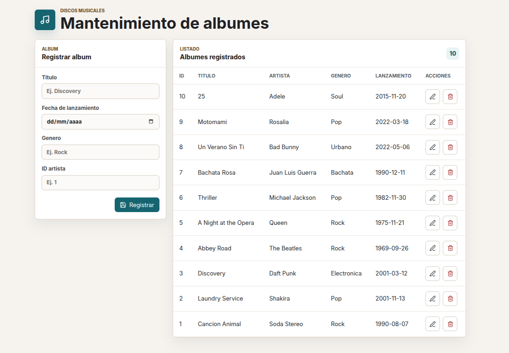

# Discos Musicales - Practica 2

Aplicacion de mantenimiento de albumes musicales con reporte de reservas realizadas.

## Enunciado De La Practica 2


## Vista De La Aplicacion



## Funcionalidades Implementadas

- Mantenimiento de albumes musicales.
- Reporte de reservas realizadas consumido desde React con `useEffect`.
- Exportacion del reporte de reservas a PDF desde el backend.
- Exportacion del reporte de reservas a Excel desde el backend.
- Cambio de estado de reservas desde el backend.
- Validacion en base de datos para estados permitidos de reserva.

Tecnologias usadas:

- Backend: Python, Flask y PostgreSQL
- Frontend: React con Vite
- Base de datos: PostgreSQL

## Estructura Del Proyecto

```text
.
├── README.md
├── backend
│   ├── baseDatos.sql
│   ├── .env
│   ├── requirements.txt
│   ├── servidor.py
│   ├── conexion
│   │   └── conexionBd.py
│   ├── controladores
│   │   ├── albumControlador.py
│   │   └── reservaControlador.py
│   ├── modelos
│   │   ├── albumModelo.py
│   │   └── reservaModelo.py
│   └── rutas
│       ├── albumRutas.py
│       └── reservaRutas.py
└── frontend
    ├── .env
    ├── index.html
    ├── package.json
    ├── vite.config.js
    └── src
        ├── App.jsx
        ├── main.jsx
        ├── styles.css
        ├── componentes
        │   ├── FormularioAlbum.jsx
        │   ├── ReporteReservas.jsx
        │   └── TablaAlbum.jsx
        ├── paginas
        │   └── AlbumPagina.jsx
        └── servicios
            ├── albumServicio.js
            └── reservaServicio.js
```

El proyecto ahora esta en la raiz del repositorio. Ya no se entra a una carpeta `discosMusicales`.

## Configuracion Del Backend

Archivo: `backend/.env`

Ese archivo no se sube a Git. Para crearlo, copia el ejemplo:

```bash
cp backend/.env.example backend/.env
```

```env
PUERTOBACKEND=5000
PUERTOFRONTEND=5173
URLBASEBACKEND=http://localhost:5000
URLBASEFRONTEND=http://localhost:5173
RUTAAPI=/api
RUTAALBUMES=/albumes
RUTARESERVAS=/reservas
DBHOST=localhost
DBPUERTO=5436
DBDIALECTO=postgresql
DBUSUARIO=discos
DBCLAVE=123456
DBNOMBRE=discosmusicales
```

Valores importantes:

- `PUERTOBACKEND`: puerto donde corre Flask. Actualmente es `5000`.
- `PUERTOFRONTEND`: puerto donde corre React con Vite. Actualmente es `5173`.
- `URLBASEBACKEND`: URL base del backend. Actualmente es `http://localhost:5000`.
- `URLBASEFRONTEND`: URL base del frontend. Actualmente es `http://localhost:5173`.
- `RUTAAPI`: ruta base de la API. Actualmente es `/api`.
- `RUTAALBUMES`: ruta base del recurso albumes. Actualmente es `/albumes`.
- `RUTARESERVAS`: ruta base del recurso reservas. Actualmente es `/reservas`.
- `DBHOST`: servidor de PostgreSQL. Actualmente es `localhost`.
- `DBPUERTO`: puerto de PostgreSQL en Docker. Actualmente es `5436`.
- `DBDIALECTO`: motor o dialecto de base de datos. Actualmente es `postgresql`.
- `DBUSUARIO`: usuario de PostgreSQL para la aplicacion. Actualmente es `discos`.
- `DBCLAVE`: contraseña del usuario. Actualmente es `123456`.
- `DBNOMBRE`: nombre de la base de datos. Actualmente es `discosmusicales`.

Si tu PostgreSQL usa otro usuario, por ejemplo `postgres`, cambia:

```env
DBUSUARIO=postgres
DBCLAVE=tuClave
```

## Comandos Rapidos En Ubuntu

Instalar paquetes necesarios:

```bash
sudo apt update
sudo apt install postgresql postgresql-contrib python3 python3-pip nodejs npm
```

Levantar PostgreSQL:

```bash
sudo systemctl start postgresql
sudo systemctl enable postgresql
```

Crear el contenedor PostgreSQL del proyecto:

```bash
docker run -d --name discosmusicales_postgres \
  -e POSTGRES_USER=discos \
  -e POSTGRES_PASSWORD=123456 \
  -e POSTGRES_DB=discosmusicales \
  -p 5436:5432 \
  postgres:16-alpine
```

Esto crea:

```text
usuario: discos
clave: 123456
base de datos: discosmusicales
puerto local: 5436
```

Despues verifica que `backend/.env` tenga `DBUSUARIO=discos` y `DBCLAVE=123456`.

## Base De Datos

La base de datos esta en:

```text
backend/baseDatos.sql
```

Para limpiar las tablas y ejecutar la migracion inicial con los datos actuales del proyecto:

```bash
cd ~/Documentos/GitHub/practicadesarrollo
./backend/recrearBd.sh
```

Tambien puedes ejecutar todo automaticamente con:

```bash
cd ~/Documentos/GitHub/practicadesarrollo
chmod +x backend/recrearBd.sh
./backend/recrearBd.sh
```

El script limpia el esquema `public`, ejecuta `backend/baseDatos.sql` y verifica la conexion con el usuario del `.env`.

Ese comando usa:

```text
usuario: discos
clave: 123456
base de datos: discosmusicales
puerto: 5436
```

Para ejecutar la migracion manualmente en PostgreSQL:

```bash
PGPASSWORD="123456" psql -h localhost -p 5436 -U discos -d discosmusicales -f backend/baseDatos.sql
```

Si pide clave, escribe `123456`.

Si usas otro usuario:

```bash
psql -h localhost -p 5436 -U tuUsuario -d discosmusicales -f backend/baseDatos.sql
```

La base creada se llama:

```text
discosmusicales
```

Tablas creadas:

- `artista`
- `album`
- `tema`
- `reserva`

La migracion inicial registra 10 albumes de prueba con sus artistas, un tema por album y 5 reservas de prueba.

Estados permitidos para las reservas:

- `Pendiente`
- `Confirmada`
- `Cancelada`
- `Completada`

El contenedor Docker crea el usuario y la base de datos.

El unico archivo SQL crea tablas y datos iniciales:

```text
backend/baseDatos.sql
```

Para ejecutar la migracion usando los valores de `backend/.env`:

```bash
set -a
. backend/.env
set +a
PGPASSWORD="$DBCLAVE" psql -h "$DBHOST" -p "$DBPUERTO" -U "$DBUSUARIO" -d "$DBNOMBRE" -f backend/baseDatos.sql
```

## Como Correr El Backend

Desde la raiz del proyecto:

```bash
cd backend
python3 -m venv .venv
source .venv/bin/activate
pip install -r requirements.txt
python servidor.py
```

El backend queda corriendo en:

```text
http://localhost:5000
```

La API queda corriendo en:

```text
http://localhost:5000/api
```

## Configuracion Del Frontend

Archivo: `frontend/.env`

Ese archivo no se sube a Git. Para crearlo, copia el ejemplo:

```bash
cp frontend/.env.example frontend/.env
```

```env
VITEAPIURL=http://localhost:5000/api
```

Ese valor debe apuntar al backend usando `URLBASEBACKEND` + `RUTAAPI`.

Con la configuracion actual del backend:

```text
URLBASEBACKEND=http://localhost:5000
RUTAAPI=/api
```

Entonces en el frontend queda:

```env
VITEAPIURL=http://localhost:5000/api
```

Si cambias el puerto o la ruta del backend, tambien cambia esta URL.

Ejemplo si Flask corre en el puerto `8000`:

```env
VITEAPIURL=http://localhost:8000/api
```

Si cambias la ruta base del backend a `/backend`, entonces:

```env
VITEAPIURL=http://localhost:5000/backend
```

## Como Correr El Frontend

Desde la raiz del proyecto:

```bash
cd frontend
```

Instala dependencias solo si es la primera vez o si no existe la carpeta `node_modules`:

```bash
npm install
```

Para iniciar React si se necesita ver la pagina:

```bash
npm run dev
```

Vite mostrara una URL parecida a:

```text
http://localhost:5173
```

## Rutas Del Backend

Rutas actuales del mantenimiento de album:

```text
GET     /api/albumes
GET     /api/albumes/<idAlbum>
POST    /api/albumes
PUT     /api/albumes/<idAlbum>
DELETE  /api/albumes/<idAlbum>
```

Rutas actuales del reporte de reservas:

```text
GET     /api/reservas/reporte
GET     /api/reservas/reporte/pdf
GET     /api/reservas/reporte/excel
PATCH   /api/reservas/<idReserva>/estado
```

Estas rutas salen de `backend/.env`:

```text
RUTAAPI=/api
RUTAALBUMES=/albumes
RUTARESERVAS=/reservas
```

Ejemplo de URL completa:

```text
http://localhost:5000/api/albumes
```

Ejemplo de URL completa para el reporte:

```text
http://localhost:5000/api/reservas/reporte
```

## Pruebas Con Curl

Listar albumes:

```bash
curl http://localhost:5000/api/albumes
```

Buscar un album por ID:

```bash
curl http://localhost:5000/api/albumes/1
```

Registrar un album:

```bash
curl -X POST http://localhost:5000/api/albumes \
  -H "Content-Type: application/json" \
  -d '{
    "tituloAlbum": "Album de Prueba",
    "fechaLanzamiento": "2026-07-02",
    "genero": "Rock",
    "idArtista": 1
  }'
```

Actualizar un album:

```bash
curl -X PUT http://localhost:5000/api/albumes/1 \
  -H "Content-Type: application/json" \
  -d '{
    "tituloAlbum": "Cancion Animal Editado",
    "fechaLanzamiento": "1990-08-07",
    "genero": "Rock",
    "idArtista": 1
  }'
```

Eliminar un album:

```bash
curl -X DELETE http://localhost:5000/api/albumes/1
```

Listar reporte de reservas:

```bash
curl http://localhost:5000/api/reservas/reporte
```

Exportar reporte a PDF:

```bash
curl -o reporte_reservas.pdf http://localhost:5000/api/reservas/reporte/pdf
```

Exportar reporte a Excel:

```bash
curl -o reporte_reservas.xlsx http://localhost:5000/api/reservas/reporte/excel
```

Cambiar estado de una reserva:

```bash
curl -X PATCH http://localhost:5000/api/reservas/1/estado \
  -H "Content-Type: application/json" \
  -d '{"estado":"Completada"}'
```

## Orden Para Ejecutar Todo

1. Instalar PostgreSQL, Python, pip, Node y npm.
2. Levantar PostgreSQL.
3. Crear la clave del usuario `postgres`.
4. Copiar `backend/.env.example` a `backend/.env`.
5. Revisar usuario, contraseña, nombre de base de datos y puerto en `backend/.env`.
6. Crear el contenedor PostgreSQL con `docker run`.
7. Ejecutar la migracion con `./backend/recrearBd.sh`.
8. Crear y activar el entorno virtual del backend.
9. Instalar dependencias con `pip install -r requirements.txt`.
10. Correr el backend con `python servidor.py`.
11. Copiar `frontend/.env.example` a `frontend/.env`.
12. Revisar la URL del backend en `frontend/.env`.
13. En el frontend ejecutar `npm install` solo si falta `node_modules`.
14. Correr el frontend con `npm run dev`.
