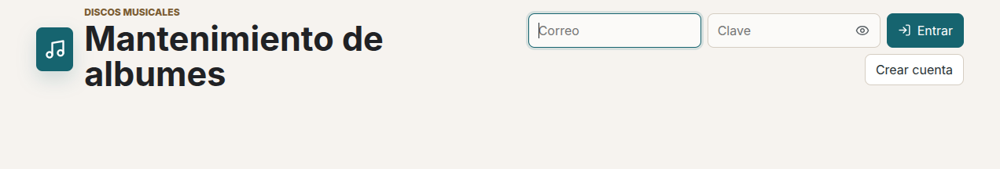
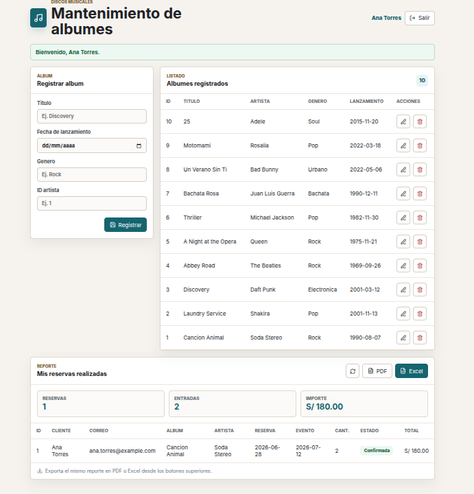

# Discos Musicales - Practica 3

Aplicacion web para mantenimiento de albumes musicales con autenticacion JWT y listado de reservas por usuario. En esta version, el sistema no muestra datos del modulo principal hasta que el usuario inicia sesion.

## Objetivo De La Practica 3

Implementar acceso con usuario y contrasena usando JWT, y crear un modulo que permita listar solamente las reservas realizadas por el usuario autenticado.

## Usuarios De Acceso

Estos usuarios se crean al ejecutar `backend/baseDatos.sql` o `./backend/recrearBd.sh`.

| Usuario | Contrasena | Reservas visibles |
| --- | --- | --- |
| `ana.torres@example.com` | `ana123` | Reservas de Ana Torres |
| `luis.ramos@example.com` | `luis123` | Reservas de Luis Ramos |
| `admin@example.com` | `admin123` | Reservas asignadas al administrador |

## Funcionalidades

- Registro de usuarios.
- Inicio de sesion con JWT.
- Proteccion de rutas de reservas con `Authorization: Bearer TOKEN`.
- Pantalla principal bloqueada hasta iniciar sesion.
- Mantenimiento de albumes musicales.
- Listado de reservas filtradas por el usuario autenticado.
- Exportacion de mis reservas en PDF.
- Exportacion de mis reservas en Excel.
- Cambio de estado de reservas.
- Base de datos con relacion entre `usuario` y `reserva`.

## Tecnologias

- Backend: Python, Flask, PyJWT, Werkzeug y PostgreSQL.
- Frontend: React, Vite y lucide-react.
- Base de datos: PostgreSQL.
- Reportes: openpyxl para Excel y reportlab para PDF.

## Vistas De La Aplicacion

### Login De Usuario



### Reservas Por Usuario



## Estructura Del Proyecto

```text
.
├── README.md
├── backend
│   ├── .env.example
│   ├── baseDatos.sql
│   ├── recrearBd.sh
│   ├── requirements.txt
│   ├── servidor.py
│   ├── conexion
│   │   └── conexionBd.py
│   ├── controladores
│   │   ├── albumControlador.py
│   │   ├── autenticacionControlador.py
│   │   └── reservaControlador.py
│   ├── modelos
│   │   ├── albumModelo.py
│   │   ├── reservaModelo.py
│   │   └── usuarioModelo.py
│   ├── rutas
│   │   ├── albumRutas.py
│   │   ├── autenticacionRutas.py
│   │   └── reservaRutas.py
│   └── seguridad
│       ├── __init__.py
│       └── jwtServicio.py
└── frontend
    ├── .env.example
    ├── index.html
    ├── package.json
    ├── vite.config.js
    └── src
        ├── App.jsx
        ├── main.jsx
        ├── styles.css
        ├── componentes
        │   ├── FormularioAlbum.jsx
        │   ├── ReporteReservas.jsx
        │   └── TablaAlbum.jsx
        ├── paginas
        │   └── AlbumPagina.jsx
        └── servicios
            ├── albumServicio.js
            ├── autenticacionServicio.js
            └── reservaServicio.js
```

## Configuracion Del Backend

Crear el archivo `.env` del backend:

```bash
cp backend/.env.example backend/.env
```

Contenido esperado:

```env
PUERTOBACKEND=5000
PUERTOFRONTEND=5173
URLBASEBACKEND=http://localhost:5000
URLBASEFRONTEND=http://localhost:5173
RUTAAPI=/api
RUTAALBUMES=/albumes
RUTARESERVAS=/reservas
JWTSECRETO=cambia-este-secreto-en-produccion
JWTHORAS=8
DBHOST=localhost
DBPUERTO=5436
DBDIALECTO=postgresql
DBUSUARIO=discos
DBCLAVE=123456
DBNOMBRE=discosmusicales
```

Variables principales:

- `JWTSECRETO`: clave usada para firmar los tokens JWT.
- `JWTHORAS`: duracion del token en horas.
- `DBHOST`, `DBPUERTO`, `DBUSUARIO`, `DBCLAVE`, `DBNOMBRE`: datos de conexion a PostgreSQL.
- `RUTAAPI`, `RUTAALBUMES`, `RUTARESERVAS`: rutas base de la API.

## Base De Datos

La base de datos se define en:

```text
backend/baseDatos.sql
```

Tablas creadas:

- `artista`
- `album`
- `tema`
- `usuario`
- `reserva`

Relacion principal de la practica:

```text
usuario."idUsuario" 1 --- N reserva."idUsuario"
```

La tabla `reserva` guarda el usuario dueno de cada reserva mediante la columna `"idUsuario"`. Por eso el endpoint de mis reservas puede filtrar y devolver solo los registros del usuario autenticado.

Datos iniciales:

- 10 artistas/albumes de prueba.
- 10 temas de prueba.
- 3 usuarios de acceso.
- 5 reservas asociadas a usuarios.

Estados permitidos para reservas:

- `Pendiente`
- `Confirmada`
- `Cancelada`
- `Completada`

## Crear PostgreSQL Con Docker

```bash
docker run -d --name discosmusicales_postgres \
  -e POSTGRES_USER=discos \
  -e POSTGRES_PASSWORD=123456 \
  -e POSTGRES_DB=discosmusicales \
  -p 5436:5432 \
  postgres:16-alpine
```

## Migrar O Recrear La Base De Datos

Desde la raiz del proyecto:

```bash
./backend/recrearBd.sh
```

El script limpia el esquema `public`, ejecuta `backend/baseDatos.sql` y verifica las tablas creadas.

Migracion manual:

```bash
PGPASSWORD="123456" psql -h localhost -p 5436 -U discos -d discosmusicales -f backend/baseDatos.sql
```

## Levantar El Backend

Desde la raiz del proyecto:

```bash
cd backend
python3 -m venv .venv
source .venv/bin/activate
pip install -r requirements.txt
python servidor.py
```

Backend:

```text
http://localhost:5000
```

API:

```text
http://localhost:5000/api
```

## Configuracion Del Frontend

Crear el archivo `.env` del frontend:

```bash
cp frontend/.env.example frontend/.env
```

Contenido esperado:

```env
VITEAPIURL=http://localhost:5000/api
```

## Levantar El Frontend

```bash
cd frontend
npm install
npm run dev
```

Frontend:

```text
http://localhost:5173
```

## Flujo De Uso

1. Abrir `http://localhost:5173`.
2. Iniciar sesion con uno de los usuarios de acceso.
3. Luego del login se muestra el mantenimiento de albumes.
4. El reporte muestra solo las reservas del usuario autenticado.
5. Desde el reporte se puede exportar PDF o Excel.
6. Al cerrar sesion, se ocultan nuevamente los datos.

## Rutas De Autenticacion

```text
POST  /api/autenticacion/registro
POST  /api/autenticacion/login
GET   /api/autenticacion/perfil
```

Login:

```bash
curl -X POST http://localhost:5000/api/autenticacion/login \
  -H "Content-Type: application/json" \
  -d '{"correo":"ana.torres@example.com","clave":"ana123"}'
```

Guardar token en una variable:

```bash
TOKEN=$(curl -s -X POST http://localhost:5000/api/autenticacion/login \
  -H "Content-Type: application/json" \
  -d '{"correo":"ana.torres@example.com","clave":"ana123"}' \
  | python3 -c "import sys, json; print(json.load(sys.stdin)['token'])")
```

Perfil autenticado:

```bash
curl http://localhost:5000/api/autenticacion/perfil \
  -H "Authorization: Bearer $TOKEN"
```

## Rutas De Albumes

```text
GET     /api/albumes
GET     /api/albumes/<idAlbum>
POST    /api/albumes
PUT     /api/albumes/<idAlbum>
DELETE  /api/albumes/<idAlbum>
```

Listar albumes:

```bash
curl http://localhost:5000/api/albumes
```

Registrar album:

```bash
curl -X POST http://localhost:5000/api/albumes \
  -H "Content-Type: application/json" \
  -d '{
    "tituloAlbum": "Album de Prueba",
    "fechaLanzamiento": "2026-07-02",
    "genero": "Rock",
    "idArtista": 1
  }'
```

## Rutas De Reservas Por Usuario

Estas rutas requieren token JWT:

```text
GET     /api/reservas/mis-reservas
GET     /api/reservas/reporte
GET     /api/reservas/reporte/pdf
GET     /api/reservas/reporte/excel
PATCH   /api/reservas/<idReserva>/estado
```

Encabezado obligatorio:

```text
Authorization: Bearer TOKEN
```

Listar mis reservas:

```bash
curl http://localhost:5000/api/reservas/mis-reservas \
  -H "Authorization: Bearer $TOKEN"
```

Exportar PDF:

```bash
curl -o reporte_reservas.pdf http://localhost:5000/api/reservas/reporte/pdf \
  -H "Authorization: Bearer $TOKEN"
```

Exportar Excel:

```bash
curl -o reporte_reservas.xlsx http://localhost:5000/api/reservas/reporte/excel \
  -H "Authorization: Bearer $TOKEN"
```

Cambiar estado:

```bash
curl -X PATCH http://localhost:5000/api/reservas/1/estado \
  -H "Content-Type: application/json" \
  -H "Authorization: Bearer $TOKEN" \
  -d '{"estado":"Completada"}'
```

## Orden Recomendado Para Ejecutar

1. Crear o verificar el contenedor PostgreSQL.
2. Copiar `backend/.env.example` a `backend/.env`.
3. Ejecutar `./backend/recrearBd.sh`.
4. Levantar el backend con `python servidor.py`.
5. Copiar `frontend/.env.example` a `frontend/.env`.
6. Levantar el frontend con `npm run dev`.
7. Iniciar sesion con un usuario de acceso.

## Nota Sobre Node

La version instalada de Vite puede requerir Node `20.19+` o `22.12+` para ejecutar `npm run build`. Para desarrollo local, usar:

```bash
npm run dev
```
